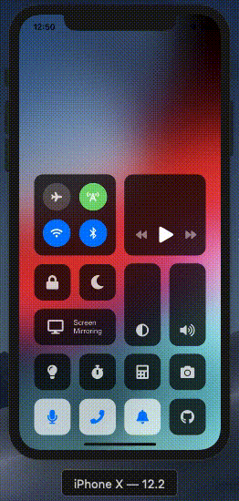

# react-native-ios-control-center

 

A copy of the iOS control center implemented on React Native.

Developed by Victor Kostyuk as a test task and is intended only to demonstrate developer skills.

## Running the project	

### iOS

```
yarn
yarn run:ios
```

CocoaPods must be installed for run on iOS

### Android

```
yarn keystore:debug
yarn run:android
```
